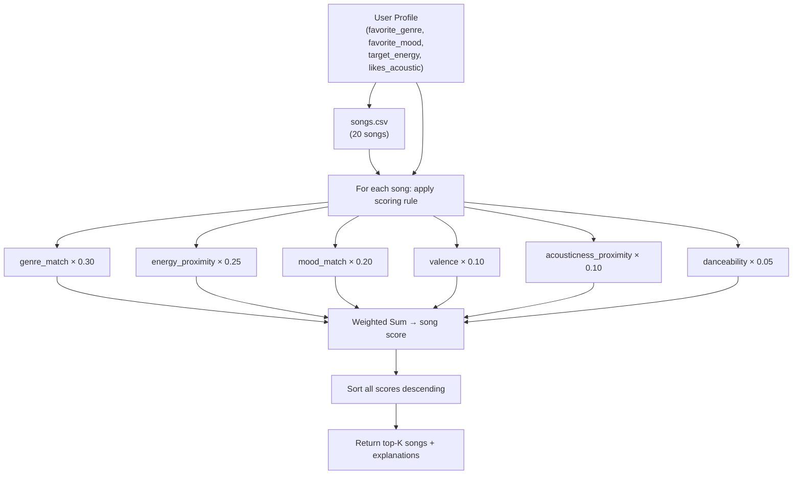

# 🎵 Music Recommender Simulation

## Project Summary

In this project you will build and explain a small music recommender system.

Your goal is to:

- Represent songs and a user "taste profile" as data
- Design a scoring rule that turns that data into recommendations
- Evaluate what your system gets right and wrong
- Reflect on how this mirrors real world AI recommenders

This simulation builds a content-based music recommender that matches songs to a user's taste profile using a weighted scoring formula. Given a user's preferred genre, mood, energy level, and acoustic preference, the system scores every song in the catalog and returns the top-K closest matches.

---

## How The System Works

Real-world recommenders like Spotify or YouTube combine **collaborative filtering** (recommending what similar users liked) and **content-based filtering** (recommending songs with similar audio features). At scale they layer on deep learning over raw audio spectrograms, NLP over lyrics and artist metadata, and real-time feedback loops that update your taste profile with every skip or replay. This simulation focuses purely on **content-based filtering** — no user history, no crowd signal — which keeps the logic transparent and easy to reason about. The priority here is matching the *feel* of a song to what the user explicitly says they want: the right genre first (biggest differentiator of musical style), then the right energy level (most physically felt), then the right emotional mood. Numerical features like energy are scored by *proximity* — rewarding songs closer to the user's target rather than simply higher or lower — while categorical features like genre and mood use a binary match. Every song gets a single weighted score, and the top-K highest scores become the recommendations.

### Song Features

Each `Song` object stores:

| Feature | Type | Role in scoring |
|---|---|---|
| `genre` | string | Categorical match against user's favorite genre (weight: 30%) |
| `mood` | string | Categorical match against user's favorite mood (weight: 20%) |
| `energy` | float 0–1 | Proximity to user's target energy (weight: 25%) |
| `valence` | float 0–1 | Proximity score; measures musical positivity (weight: 10%) |
| `acousticness` | float 0–1 | Proximity from user's `likes_acoustic` boolean (weight: 10%) |
| `danceability` | float 0–1 | Secondary activity signal (weight: 5%) |
| `tempo_bpm` | float | Normalized proximity; supporting signal |

### UserProfile Features

Each `UserProfile` stores:

| Field | Type | How it's used |
|---|---|---|
| `favorite_genre` | string | Binary match against `song.genre` |
| `favorite_mood` | string | Binary match against `song.mood` |
| `target_energy` | float 0–1 | Target for energy proximity scoring |
| `likes_acoustic` | bool | Converted to target (0.8 if True, 0.2 if False) for acousticness scoring |

### Algorithm Recipe

```
score = 0.30 × genre_match
      + 0.25 × energy_proximity
      + 0.20 × mood_match
      + 0.10 × valence
      + 0.10 × acousticness_proximity
      + 0.05 × danceability
```

Where each term is computed as:

| Term | Rule |
|---|---|
| `genre_match` | 1.0 if `song.genre == user.favorite_genre`, else 0.0 |
| `mood_match` | 1.0 if `song.mood == user.favorite_mood`, else 0.0 |
| `energy_proximity` | `1 - \|user.target_energy − song.energy\|` |
| `acousticness_proximity` | `1 - \|acoustic_target − song.acousticness\|` where `acoustic_target = 0.8 if likes_acoustic else 0.2` |
| `valence` | raw song value (0–1); higher = more positive/upbeat |
| `danceability` | raw song value (0–1); secondary activity signal |

### Scoring and Ranking

1. **Score each song** using the weighted recipe above.
2. **Rank all songs** by descending score.
3. **Return the top-K songs** (default K=5) as recommendations.

### Data Flow



### Expected Biases

- **Genre lock:** at 30% weight, a genre match alone contributes more than a perfect energy + mood combo (~0.30 vs 0.25 + 0.20 = 0.45 at best). A great song that almost matches the user's energy and mood will still lose to a mediocre genre match.
- **No partial credit for similar moods:** "chill" and "relaxed" are semantically close but score identically to "chill" vs "metal" — both get 0 for a mismatch.
- **Acousticness is binary:** `likes_acoustic` only maps to two target values (0.8 or 0.2). Users with nuanced preferences (e.g., "somewhat acoustic") are poorly served.
- **Small catalog amplifies imbalance:** with 20 songs, over-represented genres (lofi has 3 entries) will appear in top results more often than their quality warrants.

---

## Getting Started

### Setup

1. Create a virtual environment (optional but recommended):

   ```bash
   python -m venv .venv
   source .venv/bin/activate      # Mac or Linux
   .venv\Scripts\activate         # Windows

2. Install dependencies

```bash
pip install -r requirements.txt
```

3. Run the app:

```bash
python -m src.main
```

### Running Tests

Run the starter tests with:

```bash
pytest
```

You can add more tests in `tests/test_recommender.py`.

---

## Experiments You Tried

Use this section to document the experiments you ran. For example:

- What happened when you changed the weight on genre from 2.0 to 0.5
- What happened when you added tempo or valence to the score
- How did your system behave for different types of users

---

## Limitations and Risks

Summarize some limitations of your recommender.

Examples:

- It only works on a tiny catalog
- It does not understand lyrics or language
- It might over favor one genre or mood

You will go deeper on this in your model card.

---

## Reflection

Read and complete `model_card.md`:

[**Model Card**](model_card.md)

Write 1 to 2 paragraphs here about what you learned:

- about how recommenders turn data into predictions
- about where bias or unfairness could show up in systems like this


---

## 7. `model_card_template.md`

Combines reflection and model card framing from the Module 3 guidance. :contentReference[oaicite:2]{index=2}  

```markdown
# 🎧 Model Card - Music Recommender Simulation

## 1. Model Name

Give your recommender a name, for example:

> VibeFinder 1.0

---

## 2. Intended Use

- What is this system trying to do
- Who is it for

Example:

> This model suggests 3 to 5 songs from a small catalog based on a user's preferred genre, mood, and energy level. It is for classroom exploration only, not for real users.

---

## 3. How It Works (Short Explanation)

Describe your scoring logic in plain language.

- What features of each song does it consider
- What information about the user does it use
- How does it turn those into a number

Try to avoid code in this section, treat it like an explanation to a non programmer.

---

## 4. Data

Describe your dataset.

- How many songs are in `data/songs.csv`
- Did you add or remove any songs
- What kinds of genres or moods are represented
- Whose taste does this data mostly reflect

---

## 5. Strengths

Where does your recommender work well

You can think about:
- Situations where the top results "felt right"
- Particular user profiles it served well
- Simplicity or transparency benefits

---

## 6. Limitations and Bias

Where does your recommender struggle

Some prompts:
- Does it ignore some genres or moods
- Does it treat all users as if they have the same taste shape
- Is it biased toward high energy or one genre by default
- How could this be unfair if used in a real product

---

## 7. Evaluation

How did you check your system

Examples:
- You tried multiple user profiles and wrote down whether the results matched your expectations
- You compared your simulation to what a real app like Spotify or YouTube tends to recommend
- You wrote tests for your scoring logic

You do not need a numeric metric, but if you used one, explain what it measures.

---

## 8. Future Work

If you had more time, how would you improve this recommender

Examples:

- Add support for multiple users and "group vibe" recommendations
- Balance diversity of songs instead of always picking the closest match
- Use more features, like tempo ranges or lyric themes

---

## 9. Personal Reflection

A few sentences about what you learned:

- What surprised you about how your system behaved
- How did building this change how you think about real music recommenders
- Where do you think human judgment still matters, even if the model seems "smart"

