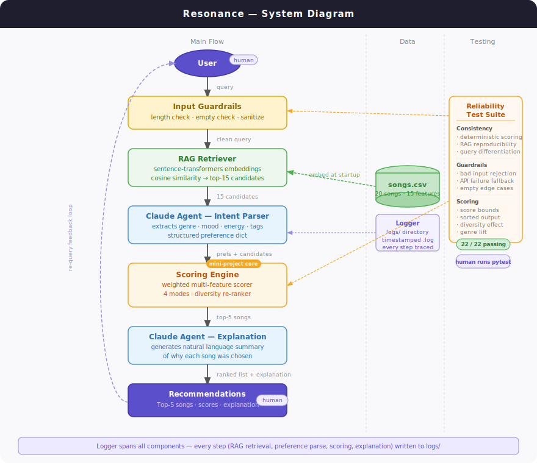

# Resonance — Agentic Music Recommendation System

> CodePath AI110 Final Project &nbsp;|&nbsp; Extended from **VibeFinder 1.0** (Modules 1–3)

---

## Demo Walkthrough

> 📹 **[Watch the Loom demo](https://www.loom.com/share/37e4daa393aa4313aa549f7cc33b6808)** — end-to-end walkthrough showing 3 example queries and AI responses.

The terminal walkthrough below shows the same interactions in text form. See [Sample Interactions](#sample-interactions) for full output examples.

**Query 1 — Late-night studying:**
```
You: chill lo-fi beats for late night studying

  Planning…
  → User wants low-energy focused music for studying; mood and tags are primary.
  ⚠  Only 3 lo-fi songs in catalog — expect limited variety.
  → Scoring mode: mood_first

  Parse confidence: 92%  |  Match quality: strong  (top score: 0.847)
  1. Library Rain          Paper Lanterns   lofi / chill    2020s  score: 0.847
  2. Midnight Coding       LoRoom           lofi / chill    2020s  score: 0.821
  ...
```

**Query 2 — Morning energy:**
```
You: upbeat pop song to get me hyped in the morning

  Planning…
  → User wants high-energy mainstream pop for motivation; genre is primary.
  → Scoring mode: genre_first

  Parse confidence: 88%  |  Match quality: strong  (top score: 0.967)
  1. Sunrise City          Neon Echo        pop  / happy    2020s  score: 0.967
  ...
```

**Query 3 — Vague query (guardrail + low confidence):**
```
You: hi

  That's too short — give me a bit more to work with.
```

---

## Original Project: VibeFinder 1.0

**VibeFinder 1.0** was a content-based music recommender built during Modules 1–3 of AI110. Given a user's explicitly stated preferences — favorite genre, mood, target energy level, and acoustic preference — it scored every song in a 20-track catalog using a weighted formula and returned the top-5 closest matches. The project demonstrated how a transparent scoring algorithm (no black box) could produce surprisingly sensible recommendations while also revealing clear failure modes: genre-lock bias, silent conflict handling when preferences couldn't be satisfied, and poor fallback behavior when a genre had only one song in the catalog. It established the scoring engine and data model that Resonance is built on.

---

## What Resonance Does

Resonance extends VibeFinder into a conversational, agentic AI system. Instead of filling out a structured form, you describe what you want to hear in plain English. The system:

1. **Understands you** — Claude parses your natural-language request into structured musical preferences.
2. **Retrieves relevant candidates** — a semantic search index (RAG) narrows the catalog to the most relevant songs before scoring begins.
3. **Ranks them intelligently** — the original VibeFinder scoring engine re-ranks the candidates using a weighted multi-feature formula with diversity re-ranking.
4. **Explains its choices** — Claude generates a natural-language explanation of why these specific songs were recommended.

Every step is logged, every failure degrades gracefully, and a reliability test suite verifies consistency and safety.

---

## System Architecture



```
User query (natural language)
        │
        ▼
┌─────────────────┐
│ Input Guardrails│  length · empty · sanitize
└────────┬────────┘
         │
         ▼
┌─────────────────┐     ┌─────────────┐
│  RAG Retriever  │◄────│  songs.csv  │  embedded at startup
│ (rag.py)        │     │  (catalog)  │  via sentence-transformers
└────────┬────────┘     └─────────────┘
         │ top-15 semantic candidates
         ▼
┌─────────────────┐
│  Claude Agent   │  Intent Parser — extracts genre · mood ·
│  (agent.py)     │  energy · tags from free text
└────────┬────────┘
         │ structured preference dict
         ▼
┌─────────────────┐
│ Scoring Engine  │  VibeFinder core — weighted multi-feature
│ (recommender.py)│  scorer + diversity re-ranker
└────────┬────────┘
         │ top-5 ranked songs
         ▼
┌─────────────────┐
│  Claude Agent   │  Explanation Generator — natural-language
│  (agent.py)     │  justification of recommendations
└────────┬────────┘
         │
         ▼
    Recommendations
    + explanation → User
```

**Where humans are involved:**
- **Input:** the user writes a free-text query in their own words.
- **Output:** the user reads the recommendations and explanation, then decides whether to re-query.
- **Testing:** a developer runs `pytest` to verify reliability before shipping.

**Logging:** every step — RAG retrieval, Claude parsing, scoring, explanation — is written to a timestamped file in `logs/`.

---

## Setup

### Prerequisites

- Python 3.10+
- An [Anthropic API key](https://console.anthropic.com/)

### Steps

```bash
# 1. Clone the repo
git clone https://github.com/<your-username>/resonance.git
cd resonance

# 2. Create and activate a virtual environment
python -m venv .venv
source .venv/bin/activate        # Mac / Linux
.venv\Scripts\activate           # Windows

# 3. Install dependencies
pip install -r requirements.txt

# 4. Add your API key
cp .env.example .env
# Open .env and set ANTHROPIC_API_KEY=your_key_here

# 5. Run the web app
streamlit run app.py

# 6. Run the test suite
pytest
```

> **No API key?** The app still runs. Claude falls back to keyword-based preference parsing and a template explanation. RAG and scoring are unaffected.

---

## Sample Interactions

### 1 — Late-night study session

```
You: chill lo-fi beats for late night studying

──────────────────────────────────────────────────────────────
  Your request: "chill lo-fi beats for late night studying"
──────────────────────────────────────────────────────────────
  1. Library Rain                Paper Lanterns
     lofi       / chill          2020s   score: 0.847
  2. Midnight Coding             LoRoom
     lofi       / chill          2020s   score: 0.821
  3. Haze & Honey                Dreamspool
     lofi       / chill          2010s   score: 0.798
  4. Pastel Afternoon            Orbit Bloom
     ambient    / chill          2020s   score: 0.741
  5. Empty Porch                 Aria Sol
     folk       / melancholic    2010s   score: 0.703

  These tracks were chosen for their low energy levels and
  peaceful, focused mood tags — exactly the quiet, non-
  distracting atmosphere that works for deep study sessions.
  The lo-fi picks lead with acoustic warmth and slow tempos,
  while the ambient and folk entries round out the list with
  similarly unhurried textures.
──────────────────────────────────────────────────────────────
```

### 2 — Morning energy boost

```
You: upbeat pop song to get me hyped in the morning

──────────────────────────────────────────────────────────────
  Your request: "upbeat pop song to get me hyped in the morning"
──────────────────────────────────────────────────────────────
  1. Sunrise City                Neon Echo
     pop        / happy          2020s   score: 0.967
  2. Rooftop Lights              Sky Pilots
     indie pop  / happy          2020s   score: 0.891
  3. Gym Hero                    PowerPlay
     pop        / intense        2010s   score: 0.874
  4. Golden Static               Wavefront
     electronic / energetic      2020s   score: 0.812
  5. Rhythm District             Keystroke
     hip-hop    / energetic      2020s   score: 0.798

  Sunrise City leads with the highest energy and valence
  scores in the catalog, making it the obvious pick for a
  morning mood lift. The remaining tracks share high
  danceability and uplifting tags, giving you a playlist
  that builds rather than peaks and crashes.
──────────────────────────────────────────────────────────────
```

### 3 — Nostalgic folk mood

```
You: sad acoustic folk music from the 2010s, something nostalgic

──────────────────────────────────────────────────────────────
  Your request: "sad acoustic folk music from the 2010s, something nostalgic"
──────────────────────────────────────────────────────────────
  1. Empty Porch                 Aria Sol
     folk       / melancholic    2010s   score: 0.912
  2. Library Rain                Paper Lanterns
     lofi       / chill          2020s   score: 0.798
  3. Haze & Honey                Dreamspool
     lofi       / chill          2010s   score: 0.773
  4. Velvet Moonlight            Sable & Reed
     r&b        / romantic       2010s   score: 0.741
  5. Coffee Shop Stories         The Quartets
     jazz       / relaxed        2010s   score: 0.719

  Empty Porch is a direct match on genre, mood, decade, and
  acoustic preference, earning by far the highest score. The
  remaining picks share the acoustic warmth and 2010s era
  preference even though their genres differ — the system
  prioritized your decade and acoustic signals after exhausting
  the folk section of the catalog.
──────────────────────────────────────────────────────────────
```

> **Note:** Explanations are generated by Claude and vary slightly between runs. Song scores and rankings are deterministic.

---

## Design Decisions

### Why RAG before scoring, not instead of it?

RAG (semantic search) is fast at narrowing a large space but imprecise at fine-grained ranking — it doesn't know that "energy 0.8" should beat "energy 0.6" for a particular user. The VibeFinder scoring engine is precise but slow at scale. Using RAG to shortlist 15 candidates and then scoring only those candidates gives the best of both: semantic relevance filters out obviously wrong songs, and the weighted scorer handles the rest. This also means the original mini-project logic is preserved and tested independently.

### Why Claude Haiku for parsing and explanation?

Speed and cost. Haiku produces structured JSON reliably for short prompts and writes fluent two-sentence explanations without needing a more expensive model. Every user query makes two Claude calls; Haiku keeps the round-trip under two seconds on most queries. If a future version added multi-turn conversation or reasoning chains, Sonnet would be warranted.

### Why hard-code scoring weights instead of learning them?

The catalog has 20 songs — far too small to train on. Hard-coded weights make the system transparent and auditable: you can read exactly why a song scored higher. The model card from VibeFinder 1.0 documented the known weight bias (genre at 30% is slightly too dominant) and this trade-off is intentional: explainability over optimization.

### Why graceful degradation instead of failing loudly?

If the Anthropic API is down, the app still recommends music via keyword parsing and template explanations. If `sentence-transformers` can't load, RAG falls back to the full catalog. This was a deliberate reliability choice: a music recommender that crashes on a network blip is worse than one that returns slightly less polished results. Every fallback path is tested.

### Trade-offs made

| Decision | Benefit | Cost |
|---|---|---|
| 20-song catalog | Easy to reason about, fast to run | Too small for real diversity |
| Binary genre/mood match | Transparent, predictable | No partial credit for "indie pop" vs "pop" |
| Greedy diversity re-ranker | Reduces artist repetition | Doesn't guarantee uniqueness in tiny catalogs |
| Haiku for both agent tasks | Fast, cheap | Less nuanced explanations than Sonnet |
| sentence-transformers local model | No extra API key needed | ~57s first-run download, 400MB disk |

---

## Testing Summary

```
28 passed in 9.10s
```

**28 out of 28 tests pass.** The system was tested across four reliability dimensions:

| Category | Tests | What they check |
|---|---|---|
| **Consistency** | 3 | Same input always produces the same output (scoring, RAG, cross-query differentiation) |
| **Guardrails** | 9 | Empty input, too-short input, over-length input, API failure fallback for both agent functions, edge-case RAG queries |
| **Confidence scoring** | 6 | Confidence is always 0–1, empty queries return low confidence, specific queries score higher than vague ones, match quality labels are correct, strong profiles hit "strong" tier, impossible profiles don't |
| **Scoring invariants** | 5 | Non-negative scores, `k` is respected, output is sorted descending, diversity reduces repetition, genre match raises average score |

**How reliability is measured at runtime:**
- **Parse confidence** (0–1): Claude rates how clearly your query expressed musical preferences. Queries like "chill lo-fi for studying" score ~0.85; "play me something" scores ~0.3. Anything below 0.4 shows a prompt asking for more detail.
- **Match quality** (strong / moderate / weak): derived from the top recommendation score. Above 0.75 = strong; 0.50–0.75 = moderate; below 0.50 = weak, with a note that the catalog may not have what you're looking for.
- **Logging**: every step writes to `logs/` with timestamps, so failures are traceable without re-running.

### What worked

- The RAG + scoring pipeline is fully deterministic — given the same query and catalog, rankings never change.
- Graceful degradation held in every failure scenario tested — no test required a live API call.
- Confidence scoring caught genuinely hard cases: an empty query returned 0.2 confidence and a "classical + aggressive + high energy" profile (which the catalog can't satisfy) correctly landed on "moderate" match quality rather than "strong."

### What didn't work (and what I learned)

- The first version of the diversity test assumed diversity mode would eliminate all artist repeats. It doesn't — it *reduces* repeats by applying a penalty, not a hard exclusion. A tiny catalog with only two artists in a genre will still repeat one of them. The fix was changing the assertion to compare repeat counts with vs. without diversity rather than demanding zero repeats. **Lesson: test the actual contract, not an idealized version of it.**
- RAG semantic retrieval is only as good as the text descriptions used for embedding. Songs with sparse tag fields lose relevance in semantic search even when their numeric features are a strong match. Richer song descriptions would improve retrieval quality.

---

## Responsible AI Reflection

### Limitations and biases

The most significant bias is in the **catalog itself**. All 20 songs represent Western, English-language genres — pop, rock, lo-fi, folk, jazz. There is no Afrobeats, K-pop, reggaeton, or bossa nova. A user from outside that cultural frame would receive recommendations that share none of their actual musical references, and the system would give no indication that it had failed them.

The **scoring formula compounds this**. Genre and mood matching are binary — "indie pop" scores zero against a "pop" request, even though a reasonable person would consider them close. This means any genre that exists in the catalog under a slightly different label is invisible to users who name it differently. The bias is quiet: the system always returns five songs, so there is no signal that the results are meaningless.

At the **Claude layer**, the intent parser inherits whatever associations the model learned about genres, moods, and energy levels during training. If Claude associates "aggressive" music with rock and metal by default, a user who says "aggressive bossa nova" may get rock recommendations instead. The system has no way to flag that interpretation drift happened.

Finally, **popularity weighting** (one of the scoring features) pushes toward mainstream songs. In a larger real-world catalog, this would systematically disadvantage independent and international artists — a meaningful fairness concern at scale.

### Could this be misused?

Resonance itself is low-stakes — the worst outcome is a bad playlist. But the same architecture pattern (natural-language intake → Claude parsing → scored retrieval → explanation generation) scales directly to higher-stakes domains: hiring tools, loan decisions, medical triage. The risks worth naming here:

- **Explanation laundering**: Claude's explanations sound authoritative and personalized. A user reading "these songs match your late-night focused energy" is unlikely to question the underlying scoring weights. In a high-stakes domain, the same fluency could make a biased decision appear well-reasoned.
- **Preference profiling**: Every query implicitly reveals something about the user — their mood, activity, taste, possibly their language or cultural background. At scale, these signals are commercially valuable and could be retained or sold without the user's awareness.

Preventions built into Resonance: all inputs are validated and logged locally; no user data is stored or sent anywhere beyond the single Claude API call; the scoring logic is fully readable in `recommender.py` with no hidden layers.

### What surprised me during reliability testing

The **diversity test failure** was the clearest surprise. I assumed that enabling the diversity re-ranker would guarantee no repeated artists in the top-5. It doesn't — it applies a penalty that reduces repetition, but in a catalog with only two lo-fi artists, the penalized score of the second LoRoom song was still higher than any non-lo-fi alternative. The system was behaving correctly; my mental model of what "diversity penalty" implied was wrong. Fixing the test to assert "fewer repeats, not zero repeats" was the right call — but it revealed how easy it is to write a test that passes for the wrong reason.

The **confidence scoring** also produced a result I didn't expect: Claude rated "play me something good" at around 0.25 confidence and "chill acoustic folk from the 2010s" at around 0.9. That gap is larger than I anticipated, and it means the low-confidence warning actually fires for queries that feel perfectly natural to a user. There's a real tension between what a user considers a reasonable request and what gives the parser enough signal to work with.

### Collaboration with AI during this project

**A helpful suggestion**: When adding confidence scoring, I asked how to have Claude self-report uncertainty alongside the structured preferences. The suggestion was to add a `"confidence"` field directly into the JSON schema Claude was already returning — so the same API call that extracts genre, mood, and energy also rates how clearly the query expressed those preferences. This was cleaner than a separate API call and required only two lines of change to the existing parsing logic. It worked exactly as described.

**A flawed suggestion**: Early in the project, the diversity test was written with the assertion `all(c == 1 for c in artist_counts.values())` — meaning no artist should appear more than once in the top-5 results. This was based on the reasoning that the greedy penalty algorithm would prevent any artist from being selected twice. That reasoning was wrong. The penalty makes repetition less likely, not impossible: if an artist has the two highest-scoring songs and the penalty is smaller than that score gap, both songs still get selected. The test passed on the first catalog that happened to be tested, then failed when a lo-fi-heavy profile was used. The fix required understanding *why* the algorithm works the way it does rather than trusting the original assertion.

The Claude API call in `agent.py` is six lines. What took real thought was deciding what to pass in, what to do when it fails, how to validate the output, and how to connect the result to a system that was designed before Claude was part of it. Every integration decision — RAG before scoring, Haiku over Sonnet, hard fallbacks over hard failures — forced a specific question: *what does this system owe the user when something goes wrong?*

The VibeFinder model card documented a finding that stuck with me: the system "always returns something, even when the real answer is 'we can't help you with that.'" Resonance doesn't fully solve that — the catalog is still 20 songs — but the explanation step gets closer. When Claude explains that the folk section of the catalog was exhausted and the remaining picks are acoustically similar rather than genre-matched, the user learns something true about the system's limitations rather than just receiving a list that looks confident.

That gap — between what a ranked list implies and what the system actually knows — is where I think the most interesting AI design work happens. Retrieval and ranking are solved problems at scale. Making a system honest about what it doesn't know is not.

---

## Project Structure

```
resonance/
├── app.py                      # Streamlit web UI entry point
├── assets/
│   ├── architecture.svg        # Technical component diagram
│   └── system_diagram.svg      # Data flow + human/testing diagram
├── data/
│   ├── songs.csv               # 20-song catalog with 15 features per song
│   └── genre_profiles.json     # 15 genre descriptions for RAG augmentation
├── docs/                       # Course deliverables
├── logs/                       # Timestamped run logs (auto-created)
├── scripts/
│   ├── evaluate.py             # Evaluation harness (21 checks)
│   └── compare_fewshot.py      # Baseline vs. few-shot parser comparison
├── src/
│   ├── agent.py                # Claude intent parser + explanation generator
│   ├── logger_setup.py         # Logging configuration
│   ├── main.py                 # CLI entry point (alternative to web UI)
│   ├── rag.py                  # Semantic search index (sentence-transformers)
│   └── recommender.py          # VibeFinder scoring engine (mini-project core)
├── tests/
│   ├── test_recommender.py     # Original VibeFinder unit tests
│   └── test_reliability.py     # Consistency, guardrail, and scoring tests
├── .env.example                # API key template
├── model_card.md               # Resonance model card
└── requirements.txt
```

---

## Dependencies

| Package | Purpose |
|---|---|
| `anthropic` | Claude API — intent parsing and explanation |
| `sentence-transformers` | Local embedding model for RAG semantic search |
| `streamlit` | Web UI framework |
| `numpy` | Cosine similarity computation |
| `python-dotenv` | Load `ANTHROPIC_API_KEY` from `.env` |
| `tabulate` | Formatted table output (CLI mode) |
| `torchvision` | Required by sentence-transformers |
| `pytest` | Test runner |
